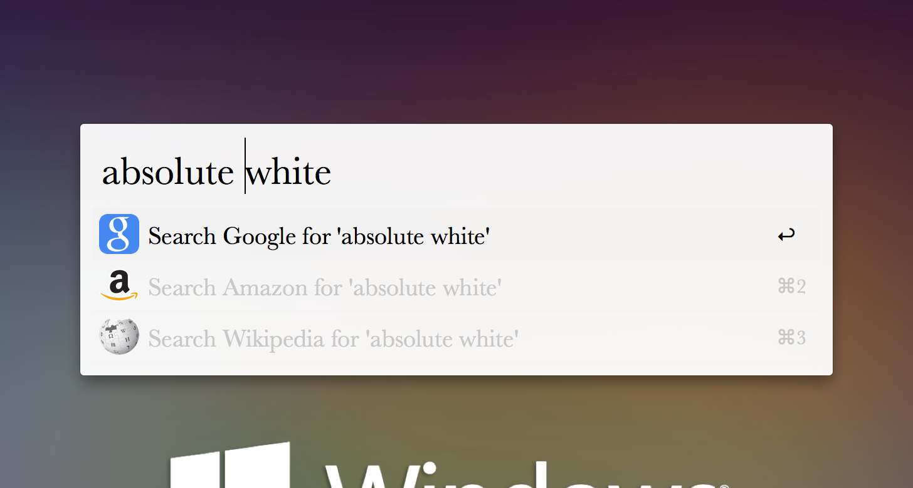
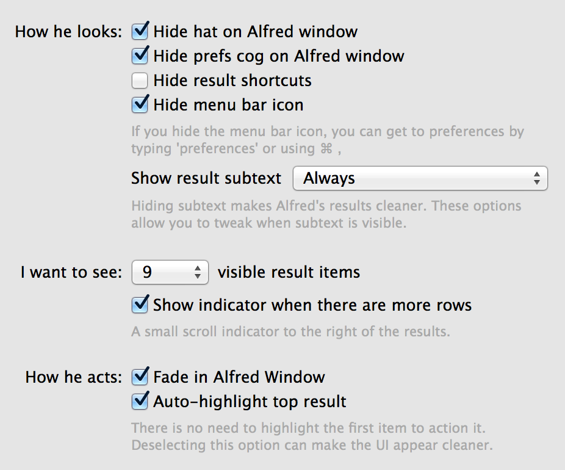

# Absolute White
Simple white theme for [alfred](http://www.alfredapp.com/)

## Install
Download [Absolute White.alfredappearance]() by right clicking and run.  
You’ll need the Powerpack for custom themes.

## Alfred options
Following this if you want to have look same as the screenshot above.

## License
MIT &copy; [vwxyutarooo](https://github.com/vwxyutarooo)
